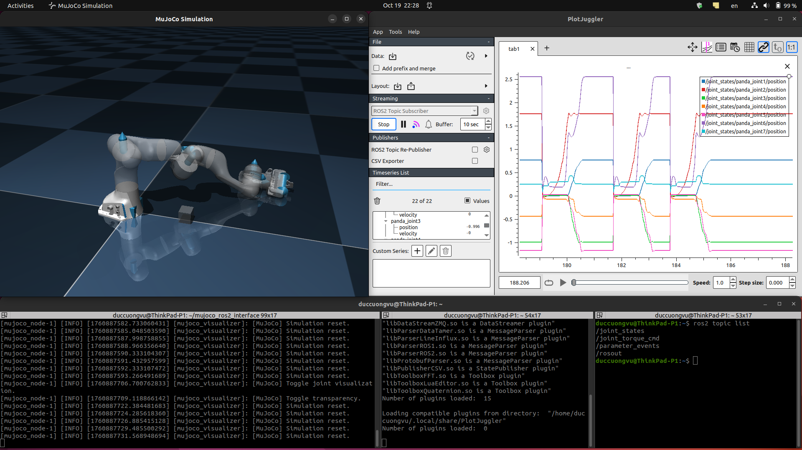

# mujoco_ros2_interface

ROS 2 interface and example node for MuJoCo (mujoCo 3.x) — experimental/development state.

This package provides a small ROS 2 node (`mujoco_node`) that loads a MuJoCo MJCF/XML model, runs the physics simulation, publishes joint states, accepts torque commands, and (optionally) shows a GLFW-based MuJoCo visualizer.

The code in this repository is intended as a starting point for integrating MuJoCo with ROS 2. It was written by a beginner ROS developer and is open for improvements and contributions.




## Contents

- `src/` - C++ sources for the node, simulator wrapper, and visualizer.
- `include/` - public headers.
- `launch/mujoco.launch.py` - example launch file that demonstrates how to pass a `model_path` parameter.
- `CMakeLists.txt`, `package.xml` - ROS 2 package build files.

## Key features

- Loads a MuJoCo model and runs `mj_step` in a ROS 2 timer loop.
- Publishes `/joint_states` (sensor_msgs/JointState) with positions and velocities.
- Subscribes to `/joint_torque_cmd` (sensor_msgs/JointState - `effort` field) to set actuators (could be customized).
- Optional GLFW visualizer (compile-time toggle via `VISUALIZE` macro in `mujoco_node.hpp`).

## Requirements

- MuJoCo 3.x installed (headers and shared libraries).
- A valid MuJoCo license (if your MuJoCo version requires one).
- ROS 2 (e.g., Humble/Galactic/Foxy — package uses generic rclcpp APIs).
- System packages: `libglfw3`/`libglfw3-dev` (GLFW), standard build tools.

On Ubuntu, install common dependencies:

```bash
# install GLFW and build tools (example for Ubuntu)
sudo apt update
sudo apt install build-essential cmake libglfw3-dev libglu1-mesa-dev libglew-dev
```

Note: package names may differ by distribution. MuJoCo itself is distributed separately from https://mujoco.org/.

## Environment variables

This package expects the MuJoCo installation path to be provided via `MUJOCO_HOME`. Example:

```bash
export MUJOCO_HOME=/home/<user>/mujoco-3.3.6
export LD_LIBRARY_PATH=$LD_LIBRARY_PATH:$MUJOCO_HOME/lib
# (optional) add those lines to ~/.bashrc or your shell rc file
```

`CMakeLists.txt` checks for `MUJOCO_HOME` and will fail if it is not set.

## Build (colcon)

Build the package inside a ROS 2 workspace as usual. From the root of your workspace:

```bash
# source your ROS 2 distribution, for example:
source /opt/ros/<distro>/setup.bash

# build
colcon build --packages-select mujoco_ros2_interface

# source the overlay
source install/setup.bash
```

If `MUJOCO_HOME` and `LD_LIBRARY_PATH` are set correctly, the package should compile and link against MuJoCo and GLFW.

## Run (launch and parameters)

An example launch file is provided at `launch/mujoco.launch.py`. The launch file resolves a `model_path` from the `robot_description` package and passes it to the node.

To run the provided launch file:

```bash
ros2 launch mujoco_ros2_interface mujoco.launch.py
```

You can also run the node directly and pass `model_path` as a parameter:

```bash
ros2 run mujoco_ros2_interface mujoco_node --ros-args -p model_path:=/full/path/to/model.xml
```

Parameters
- `model_path` (string, required) — Path to the MuJoCo XML/MJCF model file. The node will throw if this parameter is not set.

Topics
- Publishes: `joint_states` (sensor_msgs/JointState) — positions and velocities from MuJoCo.
- Subscribes: `joint_torque_cmd` (sensor_msgs/JointState) — uses the `effort` array to set MuJoCo controls.

Visualizer

- The visualizer is included and enabled by the `VISUALIZE` macro in `include/mujoco_ros2_interface/mujoco_node.hpp`. This is a compile-time flag. If enabled, the node creates a GLFW window and renders MuJoCo using the built-in visualizer wrapper.

## Troubleshooting

- CMake error: `MUJOCO_HOME is not set` — set `MUJOCO_HOME` to your MuJoCo installation directory before building.
- Linking errors (mujoco or glfw not found) — ensure `LD_LIBRARY_PATH` includes `$MUJOCO_HOME/lib` and system GLFW dev libs are installed.
- GLFW window not appearing / context errors on headless machines — the visualizer requires an X server. On headless systems use a virtual framebuffer (Xvfb) or disable visualization (compile with `VISUALIZE` set to 0).
- Model path problems — the example launch file expects a `robot_description` package that contains the MJCF file at the path used in the launch. You can override `model_path` to point to any valid MuJoCo XML.


## Contributing

Contributions, bug reports and pull requests are welcome. Please open issues or PRs on the repository. Keep changes small and focused.

